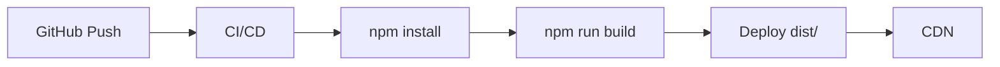
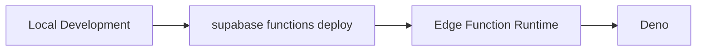
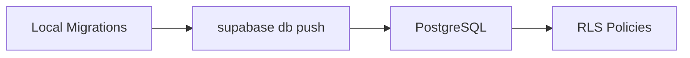

# 🏗️ Arquitectura de ScanProfit

## 📐 Diagrama de Arquitectura

```
┌─────────────────────────────────────────────────────────────────┐
│                         FRONTEND (React)                         │
│  ┌──────────────────────────────────────────────────────────┐  │
│  │                      App.tsx                              │  │
│  │  - Estado global de la aplicación                        │  │
│  │  - Gestión de autenticación                              │  │
│  │  - Manejo de lista de productos                          │  │
│  └──────────────────────────────────────────────────────────┘  │
│                              ↓                                   │
│  ┌──────────────────┐  ┌──────────────────┐  ┌──────────────┐ │
│  │  LoginScreen     │  │ ProductScanner   │  │ ProductTable │ │
│  │  - Autenticación │  │ - Input UPC      │  │ - Lista      │ │
│  │  - Validación    │  │ - Escaneo        │  │ - Eliminar   │ │
│  └──────────────────┘  └──────────────────┘  └──────────────┘ │
│                              ↓                                   │
│  ┌─────────────────────────────────────────────────────────┐   │
│  │              ProductDetails                              │   │
│  │  - Visualización del producto actual                     │   │
│  └─────────────────────────────────────────────────────────┘   │
└─────────────────────────────────────────────────────────────────┘
                              ↓
┌─────────────────────────────────────────────────────────────────┐
│                        SERVICIOS                                 │
│  ┌──────────────────────┐         ┌─────────────────────────┐  │
│  │  authService.ts      │         │  productService.ts      │  │
│  │  - loginEmployee     │         │  - fetchProductData     │  │
│  │  - logoutEmployee    │         │  - Llama Edge Function  │  │
│  │  - getCurrentEmployee│         └─────────────────────────┘  │
│  └──────────────────────┘                                        │
│            ↓                              ↓                      │
└─────────────────────────────────────────────────────────────────┘
                              ↓
┌─────────────────────────────────────────────────────────────────┐
│                    SUPABASE BACKEND                              │
│  ┌──────────────────────┐         ┌─────────────────────────┐  │
│  │  Supabase Auth       │         │  Edge Function          │  │
│  │  - JWT tokens        │         │  product-lookup         │  │
│  │  - Session mgmt      │         │                         │  │
│  └──────────────────────┘         │  1. searchUPCDatabase   │  │
│            ↓                       │     - OpenFoodFacts     │  │
│  ┌──────────────────────┐         │     - UPCItemDB         │  │
│  │  PostgreSQL          │         │  2. generatePrice       │  │
│  │  Table: employees    │         │  3. generarFicha (AI)   │  │
│  │  - id (PK, FK)       │         │     - OpenAI GPT        │  │
│  │  - email             │         └─────────────────────────┘  │
│  │  - nombre_completo   │                    ↓                  │
│  │  - puesto            │         ┌─────────────────────────┐  │
│  │  - departamento      │         │  External APIs          │  │
│  │  - activo            │         │  - OpenFoodFacts        │  │
│  │  - RLS enabled       │         │  - UPCItemDB            │  │
│  └──────────────────────┘         │  - OpenAI               │  │
│                                    └─────────────────────────┘  │
└─────────────────────────────────────────────────────────────────┘
                              ↓
┌─────────────────────────────────────────────────────────────────┐
│                      EXPORTACIÓN                                 │
│  ┌──────────────────────────────────────────────────────────┐  │
│  │  csvExport.ts                                             │  │
│  │  - Convierte productos a CSV                              │  │
│  │  - UTF-8 con BOM (compatible Excel)                       │  │
│  │  - Descarga automática                                    │  │
│  └──────────────────────────────────────────────────────────┘  │
└─────────────────────────────────────────────────────────────────┘
```

---

## 🔄 Flujo de Datos

### 1. **Autenticación**

```
Usuario → LoginScreen → authService.loginEmployee()
                              ↓
                        Supabase Auth
                              ↓
                        Verifica credenciales
                              ↓
                        Query tabla employees
                              ↓
                        Verifica empleado.activo
                              ↓
                        Update last_login
                              ↓
                        Return Employee data
                              ↓
                        App.tsx actualiza estado
                              ↓
                        Renderiza interfaz principal
```

### 2. **Búsqueda de Producto**

```
Usuario → ProductScanner (ingresa UPC)
                ↓
        handleScan(upc)
                ↓
        productService.fetchProductData(upc)
                ↓
        POST a Edge Function /product-lookup
                ↓
        ┌──────────────────────────┐
        │  Edge Function           │
        │  1. searchUPCDatabase    │
        │     ├─ OpenFoodFacts     │
        │     ├─ UPCItemDB         │
        │     └─ Fallback          │
        │  2. generateRealisticPrice│
        │  3. generarFichaProducto │
        │     └─ OpenAI GPT-4o-mini│
        └──────────────────────────┘
                ↓
        Return ProductData
                ↓
        App.tsx actualiza:
        - currentProduct (detalles)
        - scannedProducts (lista)
                ↓
        Renderiza:
        - ProductDetails
        - ProductTable
```

### 3. **Exportación a CSV**

```
Usuario → Click "Generar Excel"
                ↓
        handleExport()
                ↓
        csvExport.exportToCSV(scannedProducts)
                ↓
        1. Crear headers
        2. Mapear productos a rows
        3. Convertir a CSV
        4. Agregar BOM UTF-8
        5. Crear Blob
        6. Crear link de descarga
        7. Trigger descarga
                ↓
        Archivo CSV descargado
```

---

## 🗄️ Modelo de Datos

### **Tabla: employees**

```sql
CREATE TABLE employees (
  id uuid PRIMARY KEY,              -- FK a auth.users(id)
  email text UNIQUE NOT NULL,
  nombre_completo text NOT NULL,
  puesto text DEFAULT 'Empleado',
  departamento text DEFAULT 'General',
  activo boolean DEFAULT true,
  created_at timestamptz DEFAULT now(),
  last_login timestamptz
);
```

**Relaciones:**
- `id` → `auth.users(id)` (ON DELETE CASCADE)

**Políticas RLS:**
```sql
-- Empleados pueden ver su propia información
CREATE POLICY "Empleados pueden ver su propia información"
  ON employees FOR SELECT
  TO authenticated
  USING (auth.uid() = id);

-- Empleados pueden actualizar su último login
CREATE POLICY "Empleados pueden actualizar su último login"
  ON employees FOR UPDATE
  TO authenticated
  USING (auth.uid() = id)
  WITH CHECK (auth.uid() = id);
```

**Trigger:**
```sql
-- Crear empleado automáticamente al registrarse
CREATE TRIGGER on_auth_user_created
  AFTER INSERT ON auth.users
  FOR EACH ROW
  EXECUTE FUNCTION handle_new_employee();
```

---

## 🎯 Interfaces TypeScript

### **Product**
```typescript
interface Product {
  upc: string;
  name?: string;
  nombre?: string;
  marca?: string;
  categoria?: string;
  descripcion?: string;
  peso?: string;
  dimensiones?: string;
  ingredientes?: string;
}
```

### **Employee**
```typescript
interface Employee {
  id: string;
  email: string;
  nombre_completo: string;
  puesto: string;
  departamento: string;
  activo: boolean;
  created_at: string;
  last_login?: string;
}
```

### **ProductData (Edge Function)**
```typescript
interface ProductData {
  upc: string;
  nombre: string;
  precioAmazon: number;
  precioWalmart: number;
  precioPromedio: number;
  descripcion: string;
  fichaTecnica: {
    marca: string;
    categoria: string;
    peso: string;
    origen: string;
    codigo_barras: string;
  };
  image?: string;
  leaderPrice: number;
}
```

---

## 🔐 Seguridad

### **Frontend**
- Variables de entorno para credenciales (`.env`)
- No se exponen secrets en el código
- Validación de entrada en formularios
- Protección de rutas (redirect a login si no autenticado)

### **Backend (Supabase)**
- **RLS (Row Level Security)** habilitado
- Políticas restrictivas por defecto
- JWT tokens para autenticación
- Anon key pública (safe para frontend)
- Service role key privada (no se expone)

### **Edge Function**
- CORS configurado
- API keys en Supabase Secrets (no en código)
- Rate limiting por Supabase (por defecto)
- Validación de parámetros

### **APIs Externas**
- OpenAI API key en server-side (Edge Function)
- Fallback cuando APIs fallan
- No se exponen API keys en frontend

---

## 📊 Performance

### **Optimizaciones Implementadas**

1. **Build Optimizado**
   - Vite bundle: ~87 KB gzipped
   - Tree shaking habilitado
   - CSS purging con TailwindCSS

2. **Lazy Loading**
   - Componentes cargados bajo demanda (puede mejorarse)
   - Assets optimizados

3. **Caché**
   - Supabase client caché de sesión
   - Browser caché de assets estáticos

### **Métricas**

| Métrica | Valor |
|---------|-------|
| Bundle JS | 292 KB (87 KB gzipped) |
| Bundle CSS | 17 KB (3.87 KB gzipped) |
| HTML | 0.47 KB |
| **Total** | **~91 KB gzipped** |

---

## 🚀 Deployment

### **Frontend (Vercel/Netlify)**



### **Backend (Supabase)**



### **Database (Supabase)**



---

## 🧩 Componentes y Responsabilidades

### **App.tsx** (Orquestador)
- ✅ Estado global de la aplicación
- ✅ Maneja autenticación
- ✅ Maneja lista de productos escaneados
- ✅ Coordina componentes hijos
- ✅ Loading states

### **LoginScreen.tsx** (Autenticación)
- ✅ Formulario de login
- ✅ Validación de campos
- ✅ Manejo de errores
- ✅ Estados de carga
- ✅ UI profesional

### **ProductScanner.tsx** (Input)
- ✅ Dos modos: Manual y Escáner
- ✅ Validación de UPC
- ✅ Submit handler
- ✅ Estados de carga
- ✅ AutoFocus para escáneres

### **ProductDetails.tsx** (Visualización)
- ✅ Muestra producto actual
- ✅ Iconos para campos
- ✅ Maneja campos opcionales
- ✅ Responsive

### **ProductTable.tsx** (Lista)
- ✅ Tabla de productos
- ✅ Eliminar productos
- ✅ Estado vacío
- ✅ Responsive (oculta columnas en móvil)
- ✅ Numeración automática

### **authService.ts** (Servicio)
- ✅ Login con Supabase
- ✅ Logout
- ✅ Obtener empleado actual
- ✅ Validación de empleado activo
- ✅ Update last_login

### **productService.ts** (Servicio)
- ✅ Fetch product data
- ✅ Comunica con Edge Function
- ✅ Manejo de errores

### **csvExport.ts** (Utilidad)
- ✅ Convierte a CSV
- ✅ UTF-8 con BOM
- ✅ Headers en español
- ✅ Descarga automática

### **Edge Function: product-lookup** (Backend)
- ✅ Busca en múltiples APIs
- ✅ Genera precios realistas
- ✅ Enriquece con IA (OpenAI)
- ✅ Fallback robusto
- ✅ CORS configurado

---

## 🔄 Estado de la Aplicación

### **Estado Global (App.tsx)**
```typescript
{
  employee: Employee | null,        // Usuario logueado
  isAuthLoading: boolean,           // Loading inicial de sesión
  isLoginLoading: boolean,          // Loading durante login
  scannedProducts: Product[],       // Lista de productos
  currentProduct: Product | null,   // Producto actual mostrado
  isLoading: boolean                // Loading durante búsqueda
}
```

### **Flujo de Estados**

```
1. Inicio → isAuthLoading=true
              ↓
   checkSession()
              ↓
   employee != null → Interfaz principal
   employee == null → LoginScreen

2. Login → isLoginLoading=true
              ↓
   loginEmployee()
              ↓
   employee actualizado → Interfaz principal

3. Búsqueda → isLoading=true
              ↓
   fetchProductData()
              ↓
   currentProduct actualizado
   scannedProducts actualizado
              ↓
   isLoading=false

4. Logout → logoutEmployee()
              ↓
   employee=null
   scannedProducts=[]
   currentProduct=null
              ↓
   LoginScreen
```

---

## 📦 Dependencias Críticas

### **Producción**

| Librería | Versión | Uso |
|----------|---------|-----|
| React | 18.3.1 | Framework UI |
| @supabase/supabase-js | 2.57.4 | Backend client |
| lucide-react | 0.344.0 | Iconos |

### **Desarrollo**

| Librería | Versión | Uso |
|----------|---------|-----|
| Vite | 7.1.9 | Build tool |
| TypeScript | 5.5.3 | Lenguaje |
| TailwindCSS | 3.4.1 | Styling |
| ESLint | 9.9.1 | Linter |

---

## 🌐 APIs Externas

### **1. OpenFoodFacts**
- **URL**: `https://world.openfoodfacts.org/api/v0/product/{upc}.json`
- **Autenticación**: No requerida
- **Rate limit**: Ilimitado
- **Datos**: Productos alimenticios

### **2. UPCItemDB**
- **URL**: `https://api.upcitemdb.com/prod/trial/lookup?upc={upc}`
- **Autenticación**: No requerida (trial)
- **Rate limit**: 100 requests/día (trial)
- **Datos**: Productos generales

### **3. OpenAI**
- **Modelo**: GPT-4o-mini
- **Uso**: Generación de descripciones
- **Costo**: ~$0.15 por 1M tokens
- **API Key**: En Supabase Secrets

---

## 🎨 Sistema de Diseño

### **Paleta de Colores**

```css
/* Primary */
--orange-500: #F97316
--orange-600: #EA580C
--amber-600: #D97706

/* Neutral */
--slate-50: #F8FAFC
--slate-100: #F1F5F9
--slate-200: #E2E8F0
--slate-600: #475569
--slate-700: #334155
--slate-800: #1E293B

/* Semantic */
--red-600: #DC2626 (eliminar)
--green-600: #16A34A (éxito)
```

### **Tipografía**

```css
/* Headings */
h1: text-2xl sm:text-3xl md:text-4xl
h2: text-lg sm:text-xl md:text-2xl

/* Body */
text-sm: 0.875rem
text-base: 1rem

/* Weights */
font-medium: 500
font-semibold: 600
font-bold: 700
```

### **Espaciado**

```css
/* Padding */
p-2: 0.5rem
p-4: 1rem
p-6: 1.5rem
p-8: 2rem

/* Margin */
mb-4: 1rem
mb-6: 1.5rem
```

### **Breakpoints**

```css
sm: 640px   /* Tablet */
md: 768px   /* Desktop pequeño */
lg: 1024px  /* Desktop */
```

---

## ✅ Checklist de Arquitectura

### **Frontend**
- [x] Componentes modulares
- [x] Separación de concerns
- [x] Tipos TypeScript
- [x] Manejo de errores
- [x] Estados de carga
- [x] Responsive design
- [ ] Tests unitarios
- [ ] Tests de integración

### **Backend**
- [x] Base de datos relacional
- [x] RLS habilitado
- [x] Edge Function desplegada
- [x] CORS configurado
- [x] Manejo de errores
- [ ] Rate limiting custom
- [ ] Logs centralizados

### **Seguridad**
- [x] Variables de entorno
- [x] RLS en base de datos
- [x] JWT tokens
- [x] API keys server-side
- [ ] HTTPS enforcement
- [ ] Input sanitization

### **Performance**
- [x] Bundle optimizado
- [x] CSS purging
- [x] Tree shaking
- [ ] Code splitting
- [ ] Service worker (PWA)
- [ ] Caché estrategia

### **DevOps**
- [x] Build automatizado
- [x] TypeScript check
- [ ] Tests automatizados
- [ ] CI/CD pipeline
- [ ] Staging environment
- [ ] Monitoring/logging

---

## 🚧 Próximos Pasos

1. **Tests** - Implementar Vitest + React Testing Library
2. **PWA** - Service worker y manifest
3. **Cache** - LocalStorage para productos buscados
4. **Monitoring** - Sentry para error tracking
5. **Analytics** - Track uso de la aplicación
6. **Logs** - Centralizar logs de Edge Function
7. **Rate Limiting** - Implementar en Edge Function
8. **Optimización** - Code splitting con React.lazy()

---

**Documento de arquitectura** - Versión 1.0
**Última actualización**: 2024
